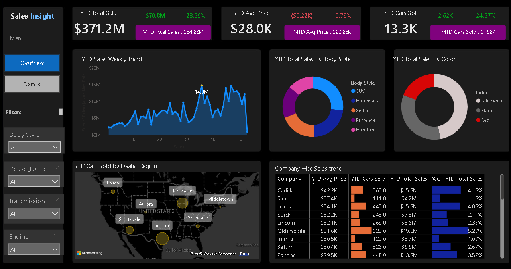

# Interactive Car Sales Dashboard with Power BI
This project demonstrates an **interactive car sales dashboard** developed using Power BI to analyze sales performance, identify trends, and provide actionable insights. The dashboard is designed to help businesses track key metrics like total sales, year-on-year growth, and dealer performance.

## 📊 Dashboard Overview
The dashboard includes:
- **Key Performance Indicators (KPIs):** Year-to-Date (YTD) Total Sales, Month-to-Date (MTD) Sales, Average Sales Price, and Cars Sold.
- **Interactive Visualizations:** 
  - Weekly sales trends over the year.
  - Sales breakdown by body style and color.
  - Dealer region-wise car sales on a geographic map.
  - Company-wise sales trends including average price and total sales.

